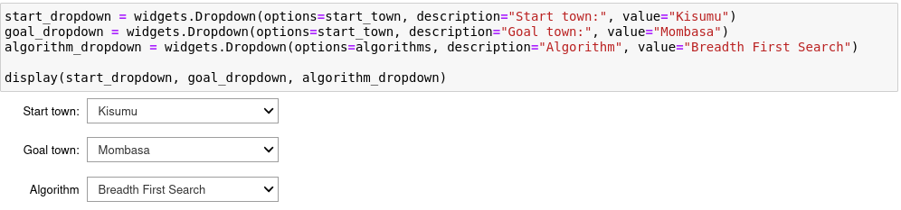
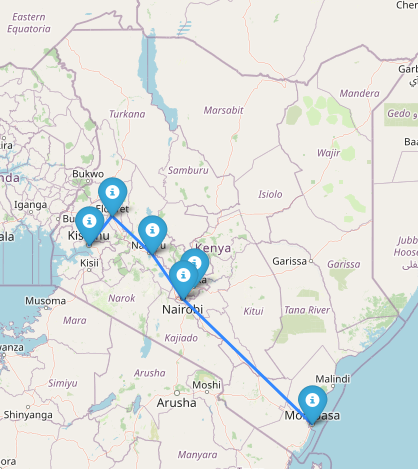

# GraphSearchAlgos
A Python implementation of the Graph data structure and search methods associated with it

This application models towns connected by straight line distances as a graph data structure. The purpose is to find the shortest distance between two towns using one of three algorithms namely **depth-first search**, **breadth-first search** and **A\* search**.

## Technologies used
The project is written in **Python** and makes use of the follwoing dependencies
- [Jupyter Notebooks](https://jupyter.org/). This enables us to have an interactive session in the browser and see the output of our Python code as we write it.
- [Folium](https://python-visualization.github.io/folium/). This dependency allows us to draw a map within the jupyter notebook and visualize the towns on the map as well as the shortest route that is selected by the algorithms.
- [geopy](https://geopy.readthedocs.io/). This package allows us to calculate distances between towns and locate towns as longitude, latitude pairs.
- [ipywidgets](https://ipywidgets.readthedocs.io/en/latest/). This package allows us to have dropdowns which we use to select between options. For example, we use this in selecting the algorithm with which to calculate the shortest route.

## Project Structure
- Vertex.py contains the implementation for a node within the Graph data structure.
- Graph.py contains the implementation of the graph data structure using adjacency lists as described [in this Wikipedia entry](https://en.wikipedia.org/wiki/Graph_(abstract_data_type)#Common_Data_Structures_for_Graph_Representation).
- search.py contains implementations for the search algorithms.
- Search.ipynb is the jupyter notebook where visualizations for the shortest route is implemented.

## Directions on Running the Notebook
1. Clone the directory and install the required dependencies in a [virtual environment](https://docs.python.org/3/library/venv.html).
2. [Run](https://jupyter-notebook-beginner-guide.readthedocs.io/en/latest/execute.html) the jupyter notebook.

## Sample Output
 <b>Fig.1 - Select the start town, end town and algorithm</b>

 <b>Fig.2 - Shortest Path visualized</b>

## Contributors
- [Jerry Nyoike](https://github.com/JerryNyoike)
